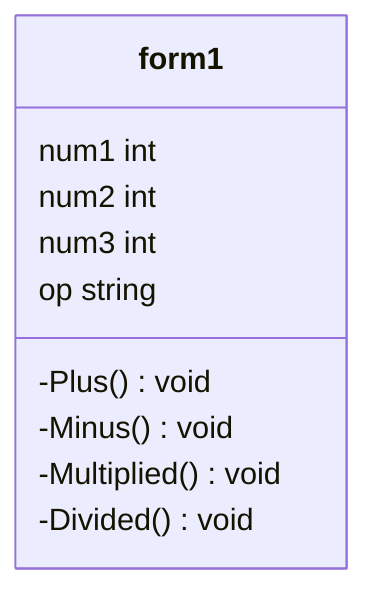

# Projact-643450330-1
ความเป็นมาของโปรเเกรม
``` 
โปรเเกรมเครื่องคิดเลข สร้างขึ้นเพื่อช่วยคำนวณเเละเเก้ปัญหาทางคณิตศาสตร์ให้ได้คำตอบอย่างรวดเร็ว
```
วัตถุประสงค์ของโปรเเกรม
```
1.ช่วยคำนวนหาผลลัพธ์สะดวกรวดเร็วโดยที่ผู้ใช้ไม่ต้องคิดเอง
2.ได้ผลลัพธ์ที่ถูกต้อง
```

Class Diagram

ผู้พัฒนาโปรเเกรม
```
นางสาว วรรณภา เบ้านาค รหัสนักศึกษา 643450330-1
```
